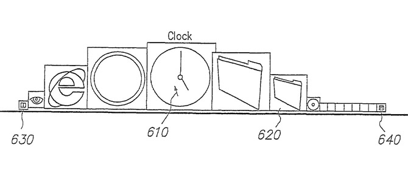
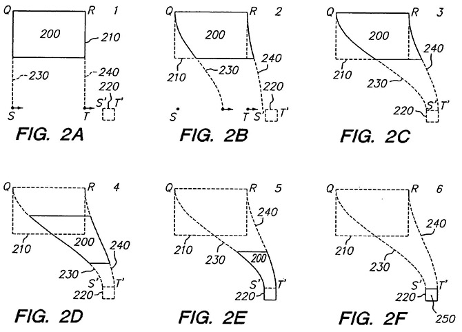
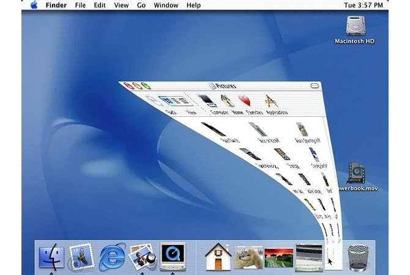
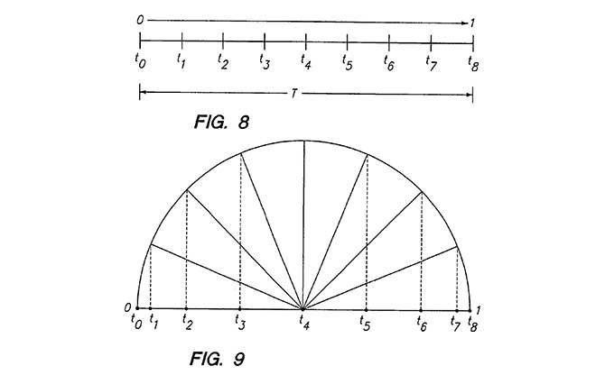

## Dock

Steve Jobs 收到一位年轻人的 Email 要应聘图形界面设计师（1998 年），应聘者很紧张，所以面试不成功，这位沮丧的设计师坐在大厅等 Steve Jobs 出来，问他是否可以看一下他的一些创意和设计，用 Adobe Director 作的 Demo，就是在屏幕下方一个可动态适应的 Dock 栏，而且有一个随着鼠标移动的放大效果，Steve Jobs 当场就雇佣他了，这位设计师就是 Bas Ording，不只是设计了很多 Mac OS 的富有特色的交互设计，还包括促成 iPhone 诞生的列表滚动和回弹效果，以及很多 iOS 上的出色交互设计。由此也可以看到 Dock 图标放大这个设计从诞生到仍在使用的今天已经有 20 年了。

对于需要在 Dock 栏放置多个图标的用户，以及考虑到十多年前的屏幕大小和显示精度，Dock 栏的放大效果是非常有效的一个视觉增强功能。对于像放大效果这样的交互设计，并非单纯源自于功能的需求，它也不像技术革新那样具有重大意义，或许人们会称之为增强了审美效果，用现在的语言来说是带来了丰富的体验，随着时代的发展，它的重要性将被越来越多的人认识到。

“随着鼠标的移动图标动态地变化”这只是一个 Idea，或者是一个创新的解决方案，还不能成为设计，要成为设计，就得考虑它具体是怎样变化。鼠标移到哪个图标，这个图标就按设定值放大，然后两边的图标以小一级的放大倍数来放大，离鼠标位置越远放大的倍数越小？

但问题是如果按上面描述的方式来实现这个放大的效果，它将是非常机械的，线性的或者是接近线性的，而 Apple 的交互设计，从 Mac OS X 到现在的 iPhone X 最大的特征就是反线性，一个机械的动态效果将会是适得其反的。Bas Ording 在这个设计中引入了几个参数和函数，为了达到更加连续和顺畅的动态效果。

首先是在鼠标两侧递减的放大倍数是连续的，而不是一级一级的，如果你把鼠标放在某一图标的中间，那么左侧和右侧的图标放大倍数是一样的，如果鼠标是放在图标某一侧而非中心的位置，那么在这个图标两侧，里鼠标越近的图标放大倍数越大。然后引入两个可变动的参数，即最大放大的倍数是靠放大后的高度（H）来决定，放大影响的范围是靠鼠标两侧的宽度（W）来决定。

在这个设计（专利 US7434177 所示）中，图标的设计是宽度可以不等，即有宽窄之分，所以图标的宽度和位置靠两边离鼠标的距离 d1 和 d2 来确定。当原始高度 h 和放大后的高度 H，以及影响范围的宽度 W 确认之后，那么放大后的在宽度上的增量 S 就可以确认，本设计使用的函数：S=((H−h)÷2)÷sine(π×(h÷2)÷(W×2))，两段各增加 S，也就是放大后的宽度是 2W+2S，S 与高度增长量（H−h）成线性正比关系，但是与影响宽度 W 是非线性的正比关系，而是引入了一个正弦函数，以原始高度 h 和影响宽度 W 指比形成的正弦函数，带来了一个非线性增大的结果，原始高度 h 越大，S 就相对越小，因为原始图标够大需要的放大倍数不需要太大。

同样放大后的图标两侧距离鼠标的距离的增加量也是通过正弦函数来与得到结果：d1′=S×sine(π÷2×d1÷W) 和 d2′=S×sine(π÷2×d2÷W)，d1′ 和 d2′ 在上图（引用自 US7434177 专利图）标示有误，通过公式来看 d1′ 和 d2′ 是增量，即放大后图标两侧离鼠标的距离为 d1+d1′ 和 d2+d2’，d1′ 和 d2′ 指来自于对一侧宽度总增量 S 的分配，通过以放大前的与鼠标距离 d1（或 d2） 与影响宽度 W 的比值作为正弦函数的因子，正弦函数值的范围就是从 0 到 1，离鼠标越近，也就是 d1（或 d2）值越小，正弦函数的特征就是因子数值越小变化率越大（在 0 到 π/2 之间），也就是离鼠标越近，增大的倍数越大。

最终增大的比例因子为：1+(d2′−d1′)÷(d2−d1)。

所以这一设计的要点有两项，一是以图标离开鼠标的距离来确定放大倍数，也就是鼠标作任何大小的移动，Dock 栏都有变动，如果鼠标在某一个图标内移动不影响旁边图标的大小，这个设计就一下子变得死板了；第二个是通过正弦函数来实现非线性的变化。

如上所示，通过参数和公式来完善设计，并非通过尝试来获得一个满意的结果，可以称之为“Tuning”（调校）。如前所述，Tuning 并非是完全客观和理性的，像这里使用到的参数和公式，并不是必然如此，而是设计师作出的选择，这种效果也可以用其他的参数和公式来实现，只不过在这个设计上 Apple 使用了设定参数的比值来作为正弦函数的因子来达到非线性的变换效果。

## Genie 效果

这就是 Steve Jobs 在 Macworld 2000 演示得乐此不彼的 Genie 动画效果，窗口缩小的默认效果是 Genie Effect ，另外还有一个 Scale Effect 供选择，Scale 效果就是单纯的缩小和放大，具有更高的执行效率，而 Genie 效果在缩小和放大之间有窗口有变形，而且变形的速度也是非线性的，动态的变换过程需要一些时间，而且连续的变形会让人感觉显得更慢。现在的 Mac OS 仍提供这两个选项，很多人喜欢 Genie 效果，也有很多人不喜欢。

上图是 Genie 效果中窗口轮廓的变化过程，来自专利文档 US7362331。这个设计的一个特点就是变形后窗口的外轮廓，当从 QR 为上边的四边形窗口变形移动到 S’T’ 为上边的四边形窗口（或图标）时，窗口的左右轮廓由直线变成了曲线，而这两条曲线在这为正弦曲线（当然它可以是其他曲线），来自函数 y=A sin(x) ，x 为图面垂直方向的距离，正弦曲线的范围定在 −π/2 和 +π/2 之间，y 为图面水平方向的距离，A 为振幅，从零到 SS’ 和 TT’ 的一半。所以当窗口当前位置确定，以及目标位置确定，左右两条曲线就能确定，窗口就沿着曲线向下缩小和移动。

这个设计的另一个特别之处，就是窗口在缩小变化过程中以怎样的速度进行了，它需要是非线性的，如果是匀速地向下移动和变化，那么就会显得很机械，非线性的运动就是在开始和结束的时候是缓慢的，而中间过程是快速的。如此前一图所示，窗口在数值方向上移动的距离是 SQ 线段，如何实现非线性的变化，这个设计引入了一个余弦函数。首先当移动变换的整体时间 T 确定后，可以将 T 划分为几等份，比如 8 等份，用 8 等份来等份分割一个半圆，在每一个分割点向下作垂线来分割直径，得到的分割距离就是从小到大再到小，用此分割线段比来划分 SQ 线段，就可以得到非线性的窗口移动变换过程。

同样，在这可以使用其他的函数或方法来实现非线性的变动，而上述方法聪明、简单、直观，虽然使用到了参数和公式，但参数和公式在这里不是原理和依据，而是一个解决问题的工具，而挑选恰好的参数和公式这种工具，就是设计中的 Tuning。
